# 数电大作业
## 结构分析
1. HOME.v 顶层模块
2. M0_ModeSelecter.v 选择模块
3. M1_TestViewer.v 数字显示屏
4. M2_Counter.v 计数器(LED实现十进制转2进制)
5. M3_Timer.v 正向计时器，带暂停
6. M4_Rtimer.v 倒计时器，带定时，闪烁,LED作进度条
7. M5_GuessNumber.v 猜数字游戏

### 顶层模块
调用逻辑：
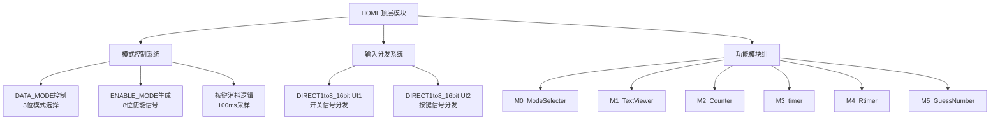
信号流向分析
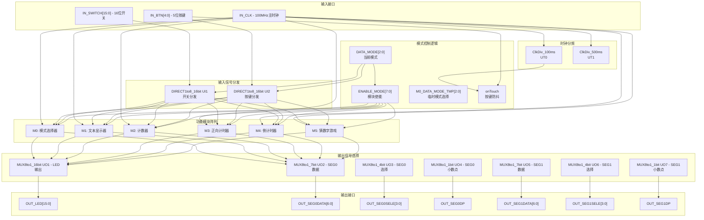

模式状态控制机
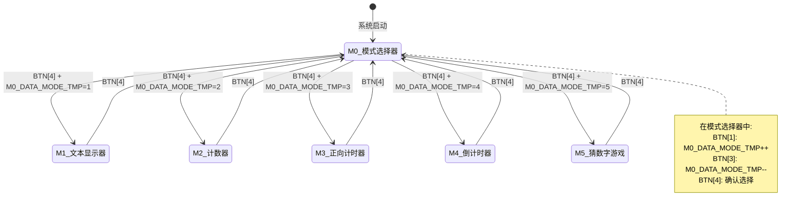

按键控制逻辑

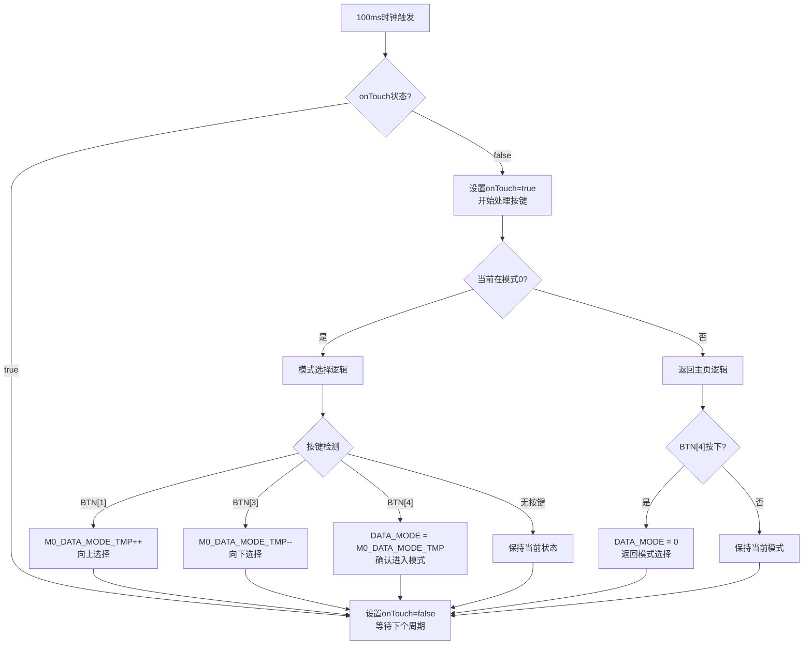
输入输出多路复用

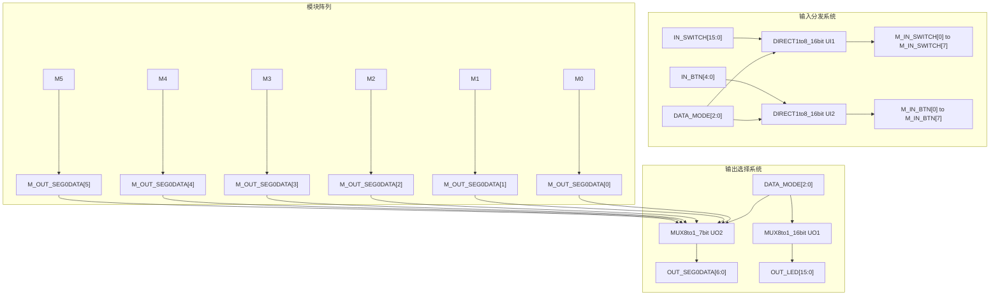
### 数码管显示驱动程序
逻辑结构图
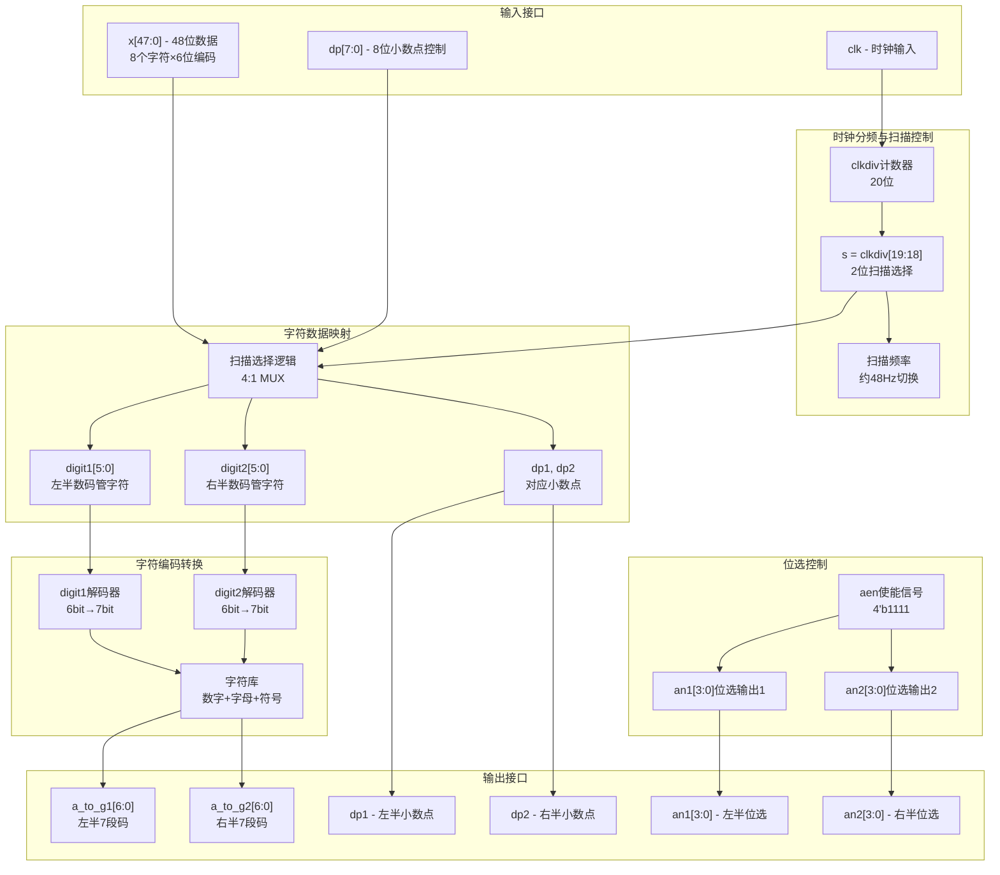
数据映射扫描逻辑
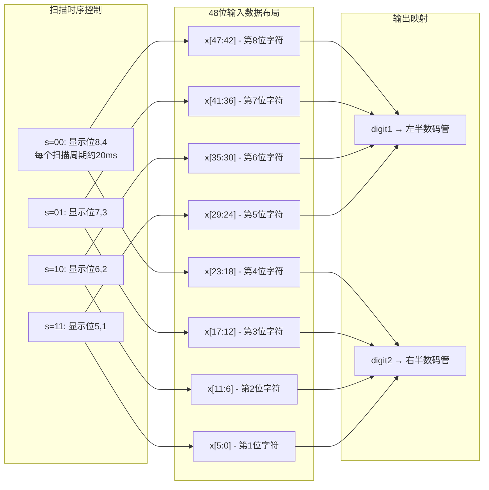
字符编码表
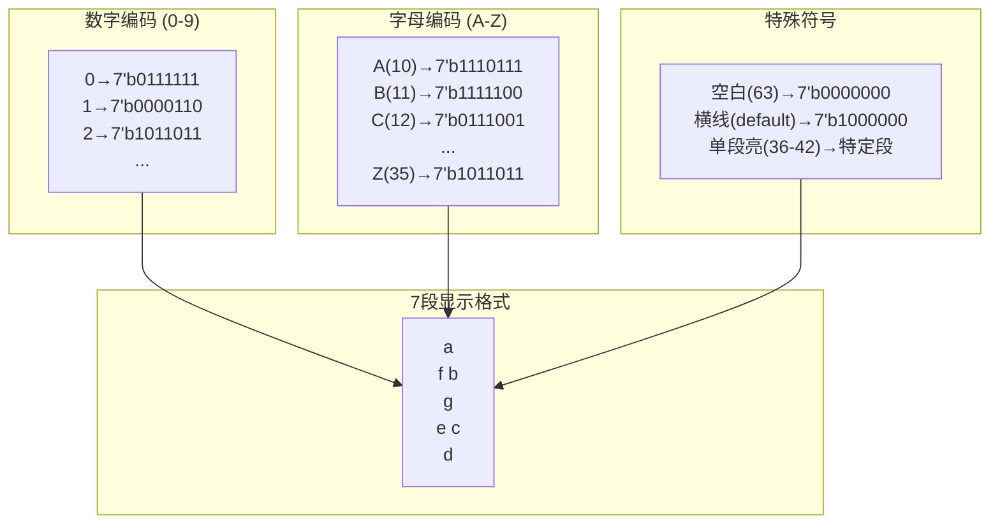

时序控制分析

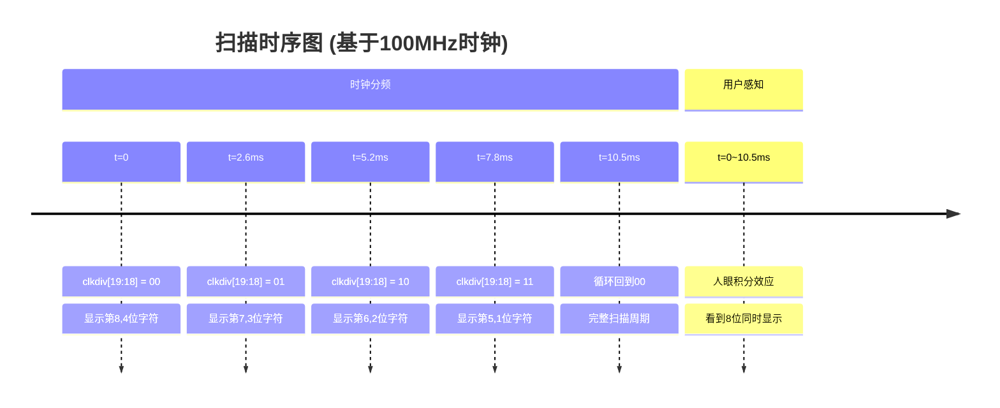
#### 闪烁控制逻辑
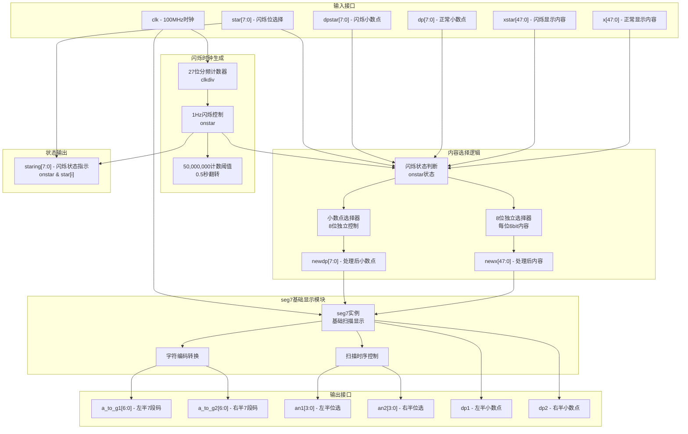

### 模块0——模式选择器
逻辑结构图
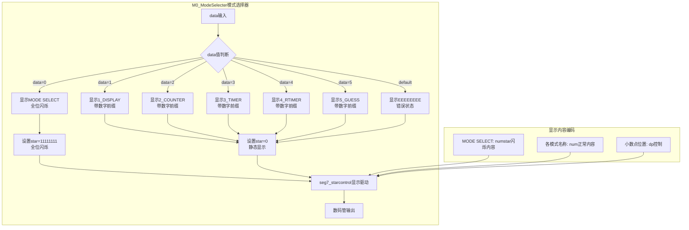
### m1_文本显示器
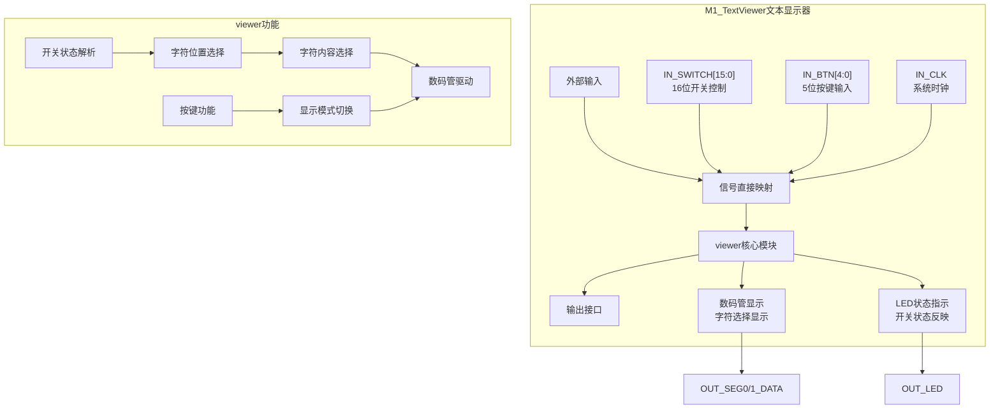

### m2_计数器
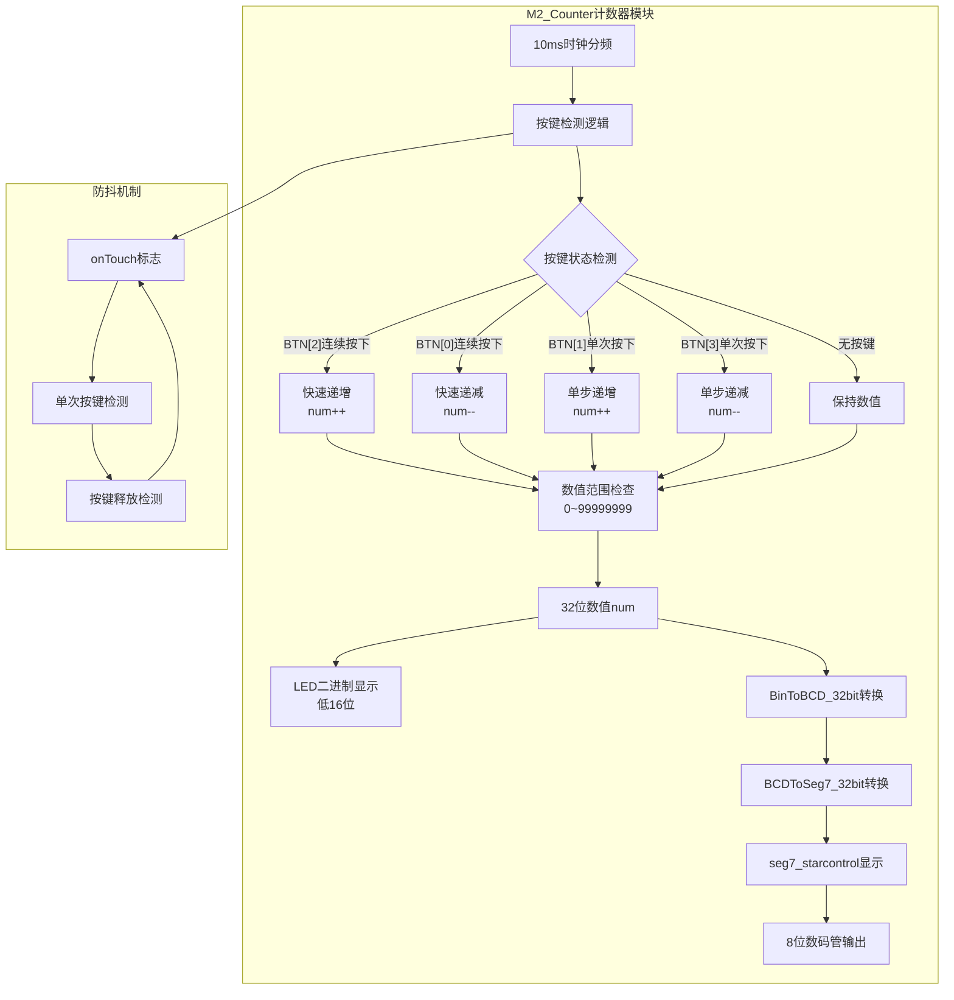

### m3_正向计时器
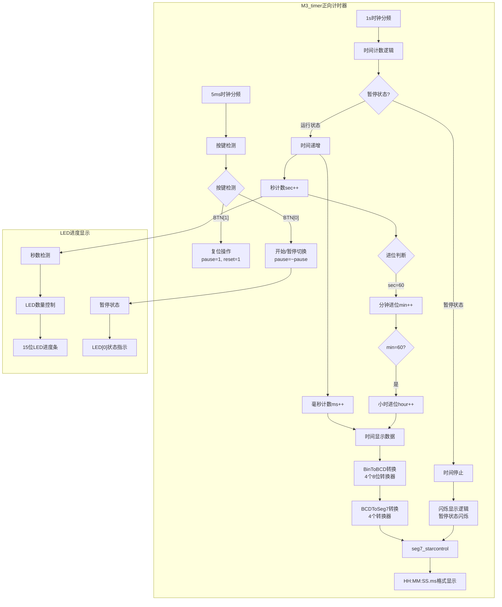

### m4_倒计时器
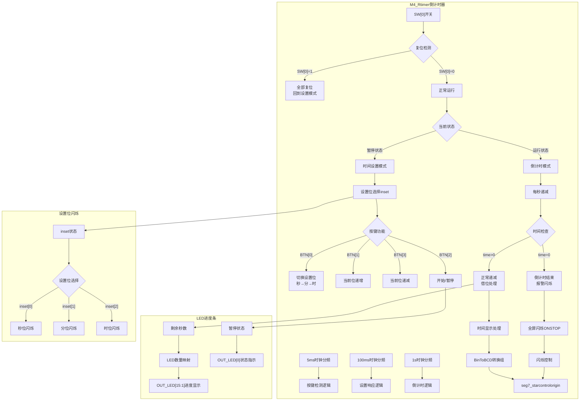

### m5_猜数字
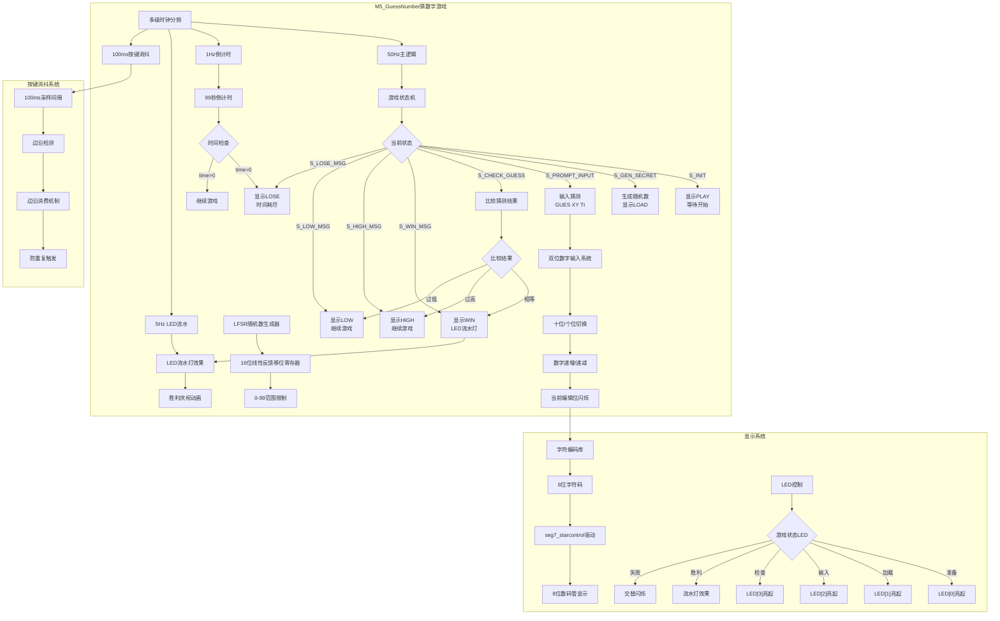